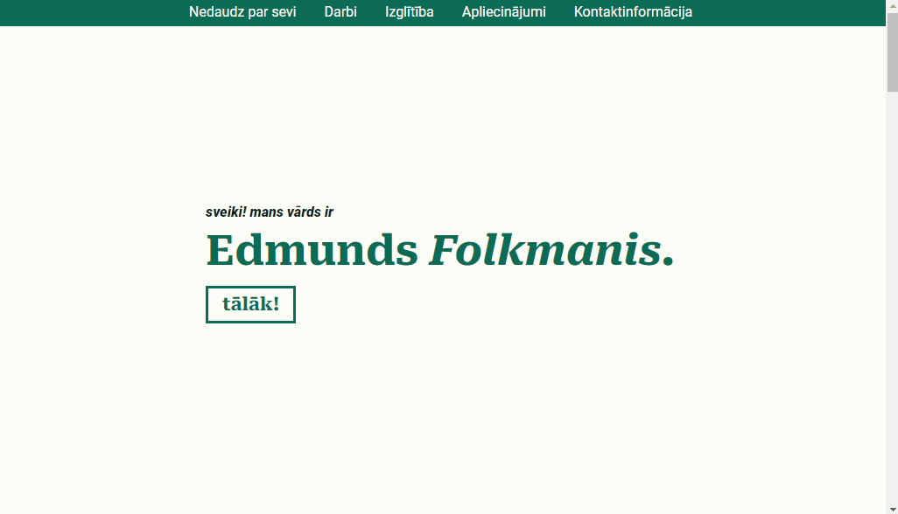

# rcs-portfolio

## Portfolio project for [Riga Coding School](https://rigacoding.lv/)

## Learning path

- HTML
- CSS
- JS

## Design inspired by

- [Simplefolio](https://github.com/cobiwave/simplefolio/tree/master)

## External resources

- Roboto by [Google Fonts](https://fonts.google.com/)

- Icons by [FontAwesome](https://fontawesome.com/)

- [ScrollReveal](https://scrollrevealjs.org/)

## Live demo

https://portfolio.folkmanis.id.lv/
